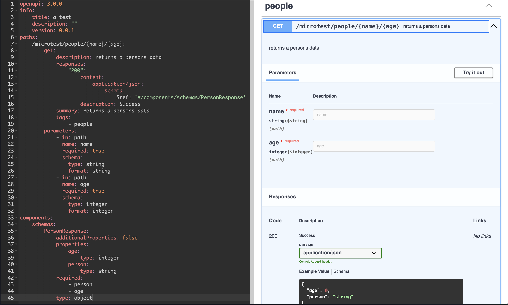

# natsoapi

This is a poc to take NATS micro information and convert it to an OpenAPI spec.

This is useful if you are going to expose services from an HTTP gateway such as Caddy.

## Pre Reqs

Your NATS Micro service(s) will have to follow some specific criteria:

1. The subject will have to contain the method type in the same location eg: `services.foo.GET`
2. The queue group defines the tag for each path.
3. Each endpoint will need path metadata for wildcards.

Here is an example endpoint with a group:
```go
	grp := svc.AddGroup(baseSubject(), micro.WithGroupQueueGroup("people"))
	grp.AddEndpoint("person",
		sdnats.ErrorHandler("person", appCtx, service.Person),
		micro.WithEndpointMetadata(map[string]string{
			"description":     "returns a persons data",
			"format":          "application/json",
			"response_schema": schemaString(&service.PersonResponse{}),
			"params": marshalStruct([]Param{
				{
					Name:     "name",
					Required: true,
					In:       "path",
					Schema: ParamSchema{
						Type:   "string",
						Format: "string",
					},
				},
				{
					Name:     "age",
					Required: true,
					In:       "path",
					Schema: ParamSchema{
						Type:   "integer",
						Format: "integer",
					},
				},
			}),
		}),
		micro.WithEndpointSubject("GET.people.*.*"),
	)
```

In this example `schemaString` returns the jsonschema of `PersonResponse{}` using `github.com/invopop/jsonschema`and marshalStruct returns a JSON marshaled string of the Params.

## Usage

1. Get your micro's name and ID with `nats micro ls`.
2. Run `go run main.go convert -n <service-name> -i <service-id> -m <method-offset> -t test -d "this is a test"`

The method offset is the location where the method is stored in the subject. For example `services.FOO.GET` would be 2.


## Sample

This is what the above example would output:




